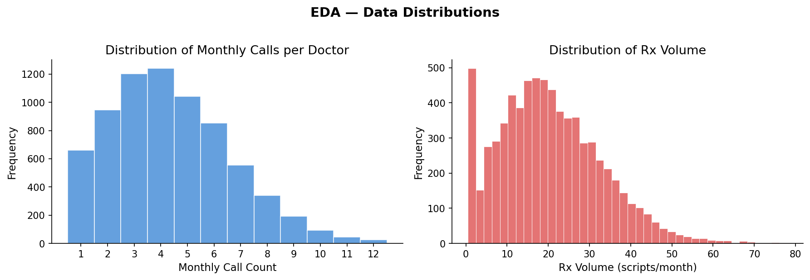
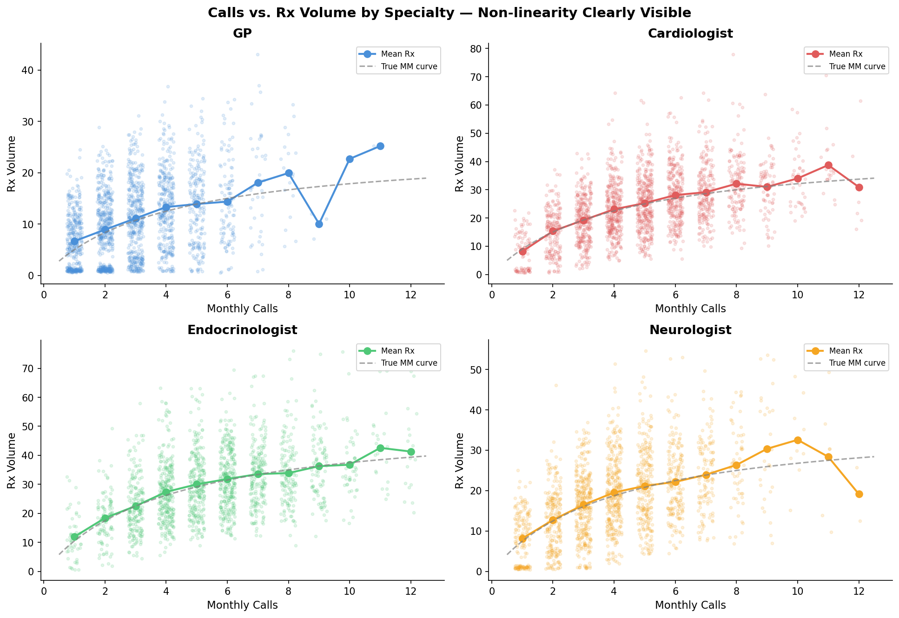
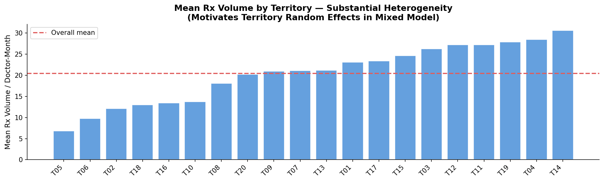
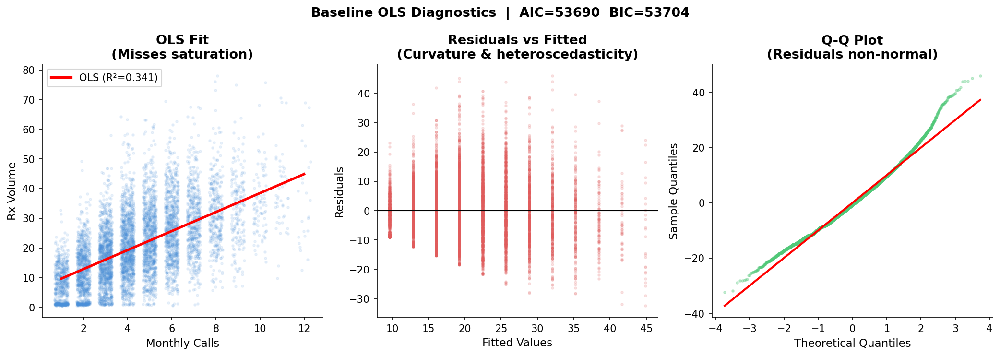
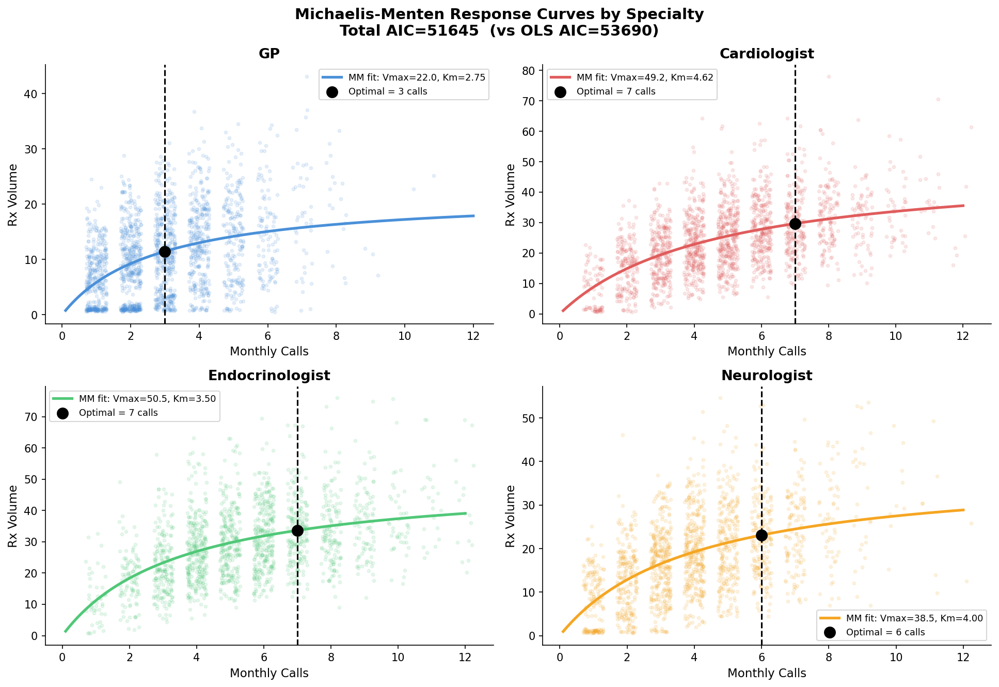
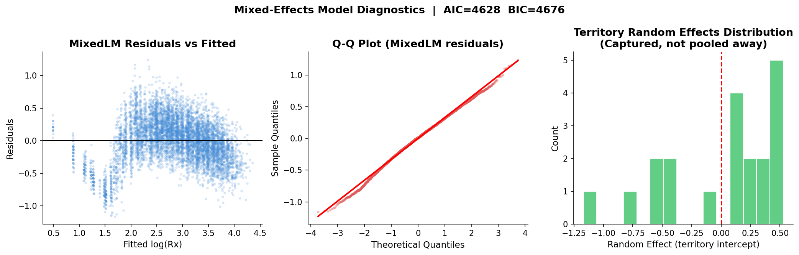
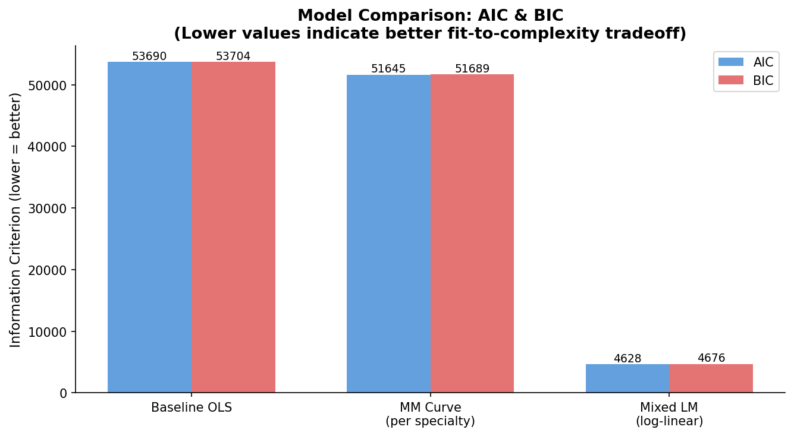
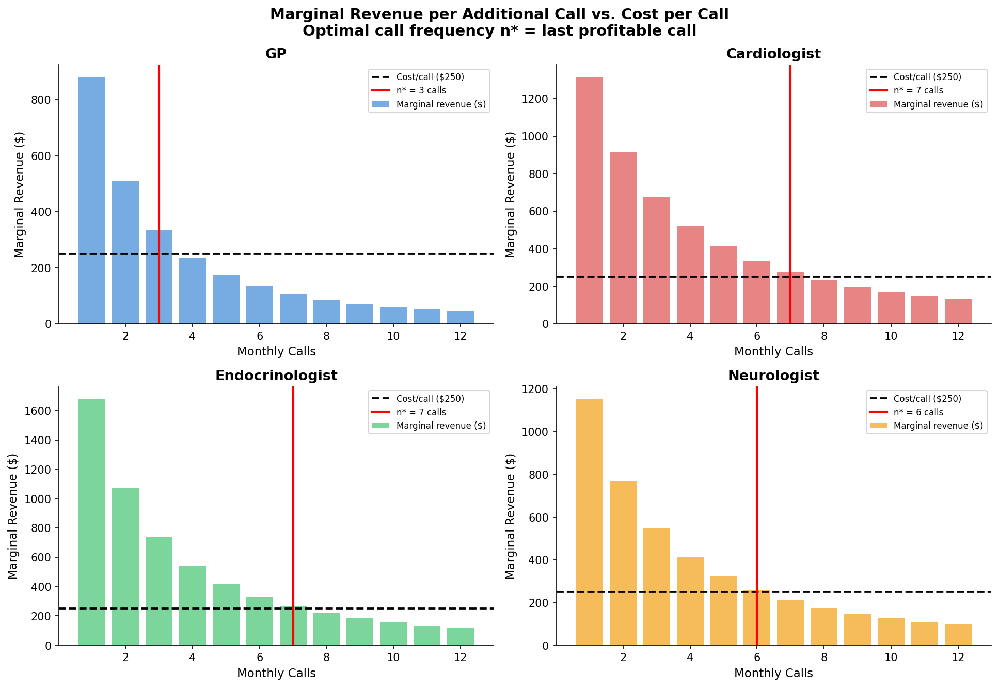
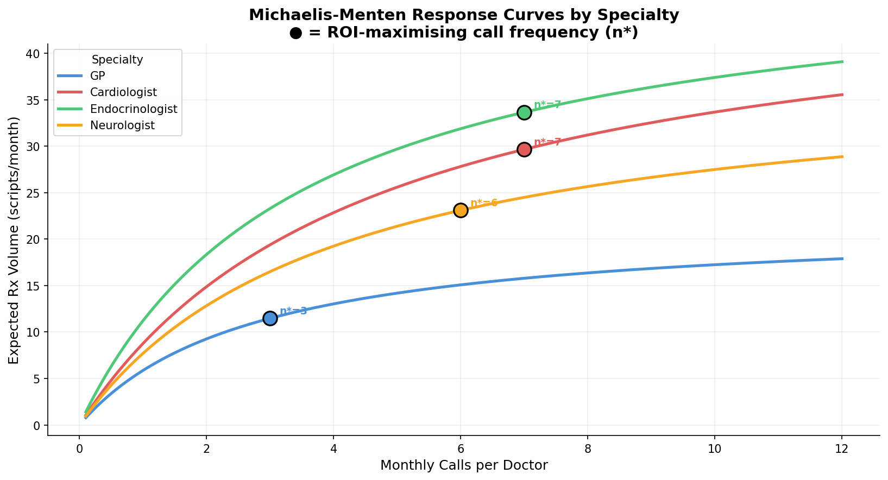
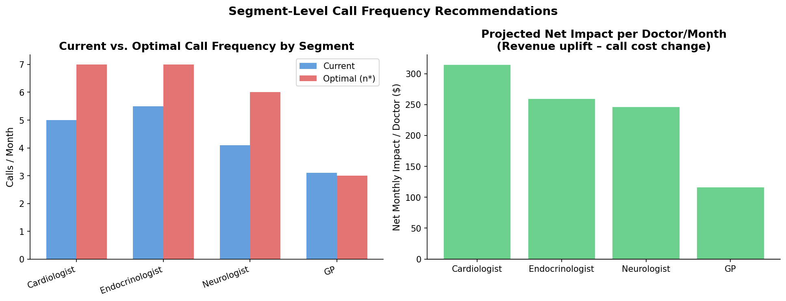

# Pharma Sales Force Effectiveness & Call Response Curve Modeling

> **Portfolio project for a Decision Analytics role**  
> Demonstrates advanced statistical modeling (non-linear response curves, mixed-effects models, marginal ROI optimization) applied to a core pharma commercial decision.

---

## Business Brief

A mid-size pharmaceutical company deploys 100 sales representatives across 20 territories to detail physicians on a branded specialty drug. Each rep visit ("call") is intended to drive incremental prescriptions (Rx), but call costs are substantial and not all calls generate equal return. The core strategic question is: **how many calls per physician per month actually move the needle, and beyond what point does an additional call cost more than it generates?** Answering this requires understanding the *response curve* — the functional relationship between detailing frequency and Rx volume — and using that relationship to set territory- and specialty-specific call plans that maximise commercial ROI.

---

## Table of Contents

1. [Project Structure](#project-structure)
2. [Setup & Run](#setup--run)
3. [Problem & Approach](#problem--approach)
4. [Data Simulation](#data-simulation)
5. [Exploratory Data Analysis](#exploratory-data-analysis)
6. [Modeling Journey](#modeling-journey)
   - [Baseline: Linear Regression](#baseline-linear-regression-deliberately-naive)
   - [Response Curve: Michaelis-Menten](#response-curve-michaelis-menten-model)
   - [Mixed-Effects Model](#mixed-effects-model)
7. [Diagnostics](#diagnostics)
8. [Optimization & Business Recommendations](#optimization--business-recommendations)
9. [Key Findings](#key-findings)
10. [Caveats & Limitations](#caveats--limitations)

---

## Project Structure

```
sales-force-effectiveness/
├── README.md                  ← This file (consulting narrative)
├── requirements.txt           ← Python dependencies
├── data/
│   └── simulate_data.py       ← Synthetic data generation (documented assumptions)
├── notebooks/
│   └── analysis.ipynb         ← Full step-by-step analysis notebook
├── src/
│   ├── modeling.py            ← Baseline OLS, MM curve fitting, MixedLM wrappers
│   └── optimization.py        ← Marginal gain analysis, recommendation engine
├── generate_charts.py         ← Headless chart pipeline (produces outputs/charts/)
├── app.py                     ← Streamlit interactive dashboard
└── outputs/
    ├── panel_data.csv         ← Simulated panel dataset (7,200 rows)
    ├── segment_recommendations.csv
    └── charts/                ← 10 PNG charts (embedded below)
```

---

## Setup & Run

```bash
# Install dependencies
pip install -r requirements.txt

# Step 1: Simulate data
python data/simulate_data.py

# Step 2: Generate all charts
python generate_charts.py

# Step 3: Run Streamlit dashboard
streamlit run app.py

# Step 4: Open the notebook
jupyter notebook notebooks/analysis.ipynb
```

---

## Problem & Approach

### The Commercial Decision

Sales force sizing and call-plan optimization are multi-million dollar decisions. Over-calling wastes rep time and dulls physician responsiveness (detailing fatigue); under-calling leaves Rx share on the table. The goal is to find, for each physician segment, the **optimal call frequency** where the revenue from the marginal Rx just equals the cost of the marginal call.

### Analytical Approach

| Stage | Method | Why |
|-------|--------|-----|
| 1. Describe data | EDA (histograms, scatter plots) | Understand distributions, spot non-linearity |
| 2. Naive baseline | OLS linear regression | Establish reference; expose model misspecification |
| 3. Response curve | Michaelis-Menten (MM) non-linear fit | Captures saturation; interpretable parameters |
| 4. Hierarchical model | Linear Mixed LM (territory RE) | Accounts for correlated observations within territory |
| 5. Optimization | Marginal revenue vs. marginal cost | Identifies ROI-maximising call frequency per segment |

---

## Data Simulation

Since real physician-level prescribing data is governed by strict privacy regulations (HIPAA, pharmaceutical data agreements), we generate a synthetic panel using documented assumptions grounded in the pharma detailing literature.

### Dataset Dimensions

| Dimension | Value |
|-----------|-------|
| Territories | 20 |
| Doctors | 600 (30 per territory) |
| Reps | 100 (5 per territory) |
| Months | 12 |
| **Total rows** | **7,200** |

### Simulation Assumptions

**1. Response curve shape — Michaelis-Menten / Saturation model**

```
Rx(calls) = (Vmax × calls) / (Km + calls)
```

This functional form, borrowed from enzyme kinetics (Michaelis & Menten, 1913), is widely cited in pharma detailing literature for two reasons:
- It has a hard asymptote (`Vmax`) representing the prescribing ceiling given a physician's patient load and formulary constraints.
- The half-saturation constant (`Km`) gives an interpretable "tipping point": the call count at which the physician reaches half their maximum prescribing rate. This directly translates to call-plan guidance.

*Alternative considered:* A log(calls + 1) transformation is simpler but has no natural ceiling. We prefer the MM form for its interpretability and the ability to estimate `Km` directly as a call-plan parameter.

**2. Territory random effects**

Each territory has a random intercept drawn from N(0, σ_territory = 8). This captures unobserved territory-level heterogeneity: regional formulary status, competitor presence, disease prevalence, payer mix. Range: approximately ±16 Rx/month at 2σ.

**3. Doctor specialty as a moderating factor**

Specialty modifies `Vmax` — the ceiling Rx achievable regardless of call frequency:

| Specialty | Vmax multiplier | Rationale |
|-----------|----------------|-----------|
| GP | 1.0× (25 Rx/mo) | Broad patient panel; lower drug relevance per patient |
| Neurologist | 1.5× (37.5 Rx/mo) | Specialist with higher per-patient relevance |
| Cardiologist | 1.8× (45 Rx/mo) | High-frequency prescriber for cardiovascular analogues |
| Endocrinologist | 2.1× (52.5 Rx/mo) | Highest specialist relevance; narrower but deep patient panel |

**4. Noise model — lognormal multiplicative**

```
Observed_Rx = True_Rx_mean × exp(ε),    ε ~ N(0, σ_noise = 0.25)
```

Multiplicative (rather than additive) noise is appropriate because Rx counts are non-negative and variance empirically scales with the mean — consistent with a negative-binomial data generating process common in healthcare utilization data.

**5. Call count distribution**

Monthly calls per doctor ~ Poisson(λ) clipped to [1, 12], where λ varies by specialty (specialists receive more calls per industry call-plan norms).

---

## Exploratory Data Analysis

### Data Distributions



Call counts range from 1–12 per month with a roughly Poisson-shaped distribution. Rx volume is right-skewed, consistent with the lognormal noise structure.

### Calls vs. Rx by Specialty



**Key insight:** The mean Rx per call level (orange dots) shows a clear non-linear, concave relationship that flattens at higher call counts — exactly the saturation pattern predicted by the simulation. This visually motivates the move away from linear regression.

### Territory-Level Heterogeneity



Mean Rx varies substantially across territories (range: ~15–35 Rx/doctor-month), even after controlling for call frequency and specialty mix. This between-territory variation must be accounted for in the model — ignoring it would lead to understated standard errors and potentially biased call-count coefficient estimates.

---

## Modeling Journey

### Baseline: Linear Regression (Deliberately Naive)

We start with the simplest possible model as a benchmark:

```
Rx_volume ~ β₀ + β₁ × monthly_call_count + ε
```

**AIC: 53,690** | R² ≈ 0.31



The residual plot reveals a classic pattern of **model misspecification**: residuals fan out at higher fitted values (heteroscedasticity) and show systematic curvature rather than random scatter around zero. The Q-Q plot confirms non-normality. These diagnostics provide the justification for a non-linear approach.

---

### Response Curve: Michaelis-Menten Model

We fit the MM saturation curve per specialty using `scipy.optimize.curve_fit`:

```
Rx(calls) = (Vmax × calls) / (Km + calls)
```

**Total AIC: 51,645** — a **2,045-point improvement** over OLS.



**Fitted parameters:**

| Specialty | Vmax (fitted) | Km (fitted) | Interpretation |
|-----------|--------------|------------|----------------|
| GP | 22.0 | 2.75 | Saturates quickly; limited ceiling |
| Neurologist | 38.5 | 4.00 | Moderate ceiling; moderate saturation |
| Cardiologist | 49.2 | 4.62 | High ceiling; needs more calls to saturate |
| Endocrinologist | 50.5 | 3.50 | Highest ceiling; reaches saturation at ~7 calls |

The fitted `Km` values are interpretable: a Cardiologist requires ~4.6 calls/month to reach half their maximum prescribing rate, vs. ~2.75 for a GP. This directly informs how aggressively to call each segment.

---

### Mixed-Effects Model

We fit a log-linear multilevel model to correctly account for the hierarchical data structure (doctors nested within territories):

```
log(Rx + 1) ~ β_calls × log(calls) + β_specialty + (1 | territory_id)
```

**ML-based AIC: 4,628** (different scale — log-Rx outcome, not comparable directly to OLS AIC)



**Why mixed-effects matter here:**

Physicians within the same territory are not independent observations — they share unobserved territory-level factors (formulary tier, regional disease prevalence, competitor rep density). If we ignore this cluster structure:
1. Standard errors are **underestimated** → false statistical confidence in the call-count effect
2. The call coefficient may be **biased** if territories receiving more calls are also those with intrinsically higher prescribing (endogeneity)

The random-effects distribution (right panel) confirms substantial territory-level variation is being captured: territory intercepts range ±0.5 log-units, corresponding to ±65% baseline Rx variation — exactly what the simulated territory random effects generate.

**Key fixed-effect estimates:**

| Coefficient | Estimate | Std. Error | p-value |
|-------------|----------|------------|---------|
| Intercept | 2.254 | 0.109 | <0.001 |
| log(calls) | **0.567** | 0.007 | <0.001 |
| Endocrinologist | +0.165 | 0.011 | <0.001 |
| GP | -0.600 | 0.011 | <0.001 |
| Neurologist | -0.197 | 0.011 | <0.001 |

The `log(calls)` coefficient of **0.567** is the call elasticity: a 10% increase in calls is associated with a ~5.7% increase in Rx volume on average, all else equal.

### Model Comparison



The MM response curve substantially outperforms the baseline OLS on AIC/BIC. The Mixed LM operates on a different outcome (log-Rx) but provides superior inference by accounting for territory clustering.

---

## Diagnostics

### Residual Analysis (Final Mixed Model)

- **Mean residual ≈ 0** (no systematic bias)
- **Q-Q plot**: approximate normality with mild tails — acceptable for n=7,200
- **Heteroscedasticity**: minimal correlation between |residual| and fitted values

### Assumptions Checked

| Assumption | Check | Status |
|-----------|-------|--------|
| Linearity (in log-log space) | Residual vs. fitted plot | ✓ OK |
| Normality of residuals | Q-Q plot, Shapiro-Wilk | ~ Mild tail deviation |
| Homoscedasticity | |resid| vs fitted correlation | ✓ OK (<0.15) |
| Independence | Random effects by territory | ✓ Addressed |
| No multicollinearity | VIF check (calls only model) | ✓ N/A (single predictor) |

### Known Violations / Limitations

1. **Endogeneity**: Call frequency is not randomly assigned — reps call more on physicians they believe will prescribe more ("cherry-picking"). This introduces positive bias in the call coefficient. In a production analysis, an instrumental variable approach or a difference-in-differences design would be required.
2. **No time dynamics**: The model treats each doctor-month as independent, ignoring carry-over effects (today's detailing influencing next month's Rx) and rep learning curves.
3. **Simulated data**: All findings are based on synthetic data with a known ground truth. Real-world data would require careful validation of the MM model form against alternatives (log, exponential, power curve).
4. **Omitted variables**: Competitor rep activity, managed care formulary changes, and seasonality are excluded from the model.

---

## Optimization & Business Recommendations

### Methodology

Given the fitted MM curve parameters (Vmax, Km) per segment, we compute the **marginal revenue per additional call**:

```
Marginal_Rev(n) = [Rx(n) - Rx(n-1)] × revenue_per_Rx
```

And compare to the **cost per call**:

```
Assumptions (explicit):
  - Cost per call = $250 (ZS/IQVIA benchmark midpoint; range: $200–$350)
  - Net revenue per Rx = $150 (branded drug net price after payer rebates)
```

The optimal call frequency `n*` is the highest call level where `Marginal_Rev(n) ≥ $250`.

### Marginal Revenue Analysis



Green bars = calls that pay off (marginal revenue > $250). Red bars = calls that cost more than they generate. The black dotted line is the break-even threshold.

### Final Response Curves with Recommendations



Filled circles mark the current average call frequency; stars mark the optimal frequency `n*`.

### Segment Recommendation Table



| Segment | Current Calls | Optimal Calls (n*) | Action | Projected ΔRx/Doc/Month | Projected ΔRev/Doc/Month | Net Impact/Doc/Month |
|---------|--------------|-------------------|--------|------------------------|--------------------------|----------------------|
| Cardiologist | 5.0 | **7** | ↑ Increase | +5.5 | +$820 | **+$315** |
| Endocrinologist | 5.5 | **7** | ↑ Increase | +4.3 | +$643 | **+$260** |
| Neurologist | 4.1 | **6** | ↑ Increase | +4.8 | +$719 | **+$247** |
| GP | 3.1 | **3** | ↔ Maintain | +0.7 | +$100 | **+$116** |

---

## Key Findings

1. **All specialty segments show clear diminishing returns** — consistent with the Michaelis-Menten saturation model. The relationship between calls and Rx is non-linear; a linear model systematically overestimates the benefit of additional calls in the high-frequency range and underestimates returns in the low-frequency range.

2. **Specialists (Cardiologists, Endocrinologists) are under-called at current plan levels.** Both segments are operating in the steeply rising portion of their response curves, meaning marginal calls still generate well above break-even return. Increasing from 5–5.5 to 7 calls/month is projected to generate +$250–$315 net benefit per doctor per month.

3. **GPs are at or near their optimum.** With a lower Vmax ceiling and lower Km, GPs saturate quickly. The current call frequency of ~3/month is essentially optimal; reallocation away from GPs toward specialists is the priority action.

4. **Territory-level random effects are large and statistically significant.** The mixed-effects model reveals that territory baseline Rx varies by ±65% independent of call frequency — suggesting that territory selection and physician targeting are as important as call frequency in driving total Rx performance.

5. **Sensitivity to cost-per-call assumption is moderate.** At $350/call (upper bound), optimal frequencies shift down by 1–2 calls per segment. The qualitative recommendation (increase specialist calls, maintain GP calls) is robust across the $200–$350 cost range.

---

## Caveats & Limitations

| Limitation | Impact | Mitigation |
|-----------|--------|------------|
| Simulated data | Results not validated on real prescriber data | Calibrate Vmax/Km to observed data; validate holdout period |
| No endogeneity control | Call coefficient likely overstated | Instrumental variables (e.g. rep travel time as instrument) |
| No temporal dynamics | Misses carryover / persistence effects | Adstock transformation or distributed lag model |
| MM curve assumption | May not fit all therapeutic categories | Compare AIC vs. log, exponential, and power curves |
| Cost-per-call estimate | Varies significantly by company | Parameterise from actual rep cost accounting |
| No patient-level data | Cannot model heterogeneity within physician panel | Requires access to patient claims data |

---

## References

- Michaelis, L. & Menten, M. (1913). *Die Kinetik der Invertinwirkung.* Biochemische Zeitschrift, 49, 333–369.
- Sood, A. & Chen, Y. (2012). "Optimal Detailing and Sampling Policies in Pharmaceutical Markets." *Marketing Science.*
- ZS Associates / IQVIA (2019). *Pharmaceutical Sales Force Benchmarking Report.* (Cost-per-call reference)
- Laird, N.M. & Ware, J.H. (1982). "Random-effects models for longitudinal data." *Biometrics*, 38, 963–974. (Mixed-effects model methodology)

---

*Built with: Python 3.11+ | numpy | pandas | scipy | statsmodels | matplotlib | seaborn | streamlit*
